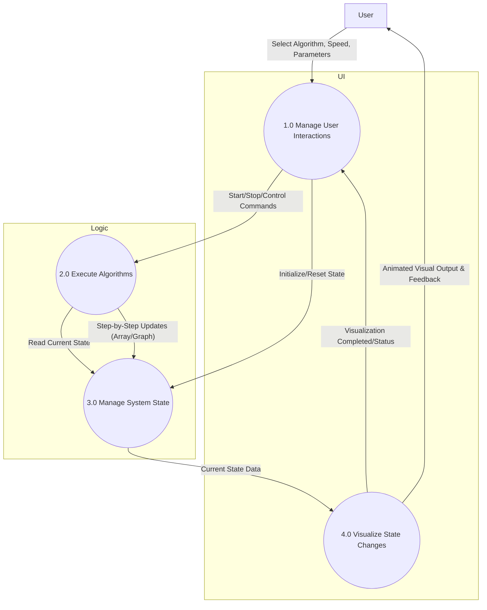
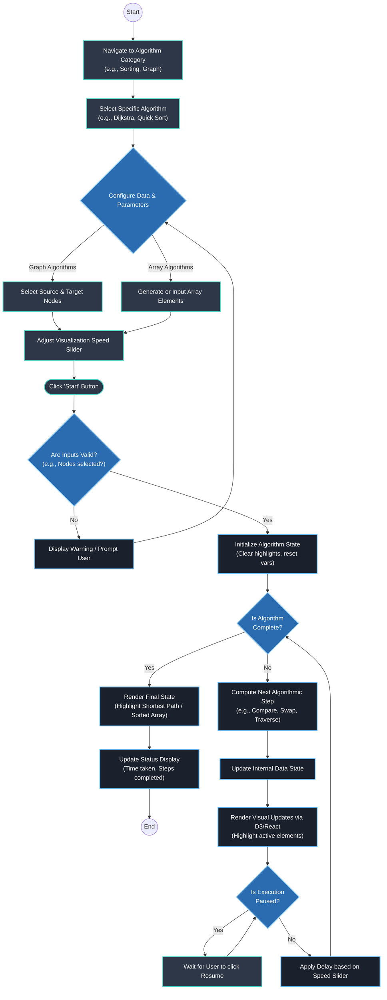

<div align="center">


# AlgoScope

**A modern, interactive algorithm visualizer that demystifies complex logic through real-time, high-fidelity animations.**

[](https://react.dev/)
[](https://vitejs.dev/)
[](https://tailwindcss.com/)
[](LICENSE)
[](CONTRIBUTING.md)
[](https://gssoc.girlscript.tech/)

Join our community for updates and support!

### Core Maintainers

<table>
       <tr>
              <td align="center" style="padding: 6px 18px;">
                     <a href="https://github.com/adityapaul26">
                            
                     </a>
                     <br />
                     <a href="https://github.com/adityapaul26"><strong>@adityapaul26</strong></a>
                     <br />
                     <a href="https://github.com/adityapaul26">
                            
                     </a>
              </td>
              <td align="center" style="padding: 6px 18px;">
                     <a href="https://github.com/Bimbok">
                            
                     </a>
                     <br />
                     <a href="https://github.com/Bimbok"><strong>@Bimbok</strong></a>
                     <br />
                     <a href="https://github.com/Bimbok">
                            
                     </a>
              </td>
       </tr>
</table>

<sub>Click a profile or follow badge for updates and to connect with the team.</sub>

</div>

---

## 💡 Project Purpose

Learning Data Structures and Algorithms (DSA) is often a daunting task for students and developers. Traditional resources like static pseudocode and textbooks fail to capture the dynamic nature of algorithms.

**AlgoScope** bridges this gap by providing a hands-on environment where users can watch the flow behind every operation. By transforming abstract logic into fluid animations, AlgoScope helps users build a mental model of how algorithms actually work, making the learning process intuitive, engaging, and accessible.

---

## ✨ Features

| Feature                     | Description                                                                                                                      |
| --------------------------- | -------------------------------------------------------------------------------------------------------------------------------- |
| **Real-time Visualization** | Watch algorithms come alive with smooth, step-by-step animations using Framer Motion and Anime.js.                               |
| **Adjustable Speed**        | Full control over animation speed and input data to learn at your own pace.                                                      |
| **Algorithm Coverage**      | Comprehensive support for Sorting (Quick, Merge, Bubble), Searching (Linear, Binary), and Graph Algorithms (BFS, DFS, Dijkstra). |
| **Code Insights**           | See the actual implementation in multiple programming languages (C++, Java, Python, JS) alongside the visualization.             |
| **Interactive Playground**  | Create custom inputs, change array sizes, and interact directly with the canvas.                                                 |
| **Clean UI/UX**             | Modern, dark-themed interface built with Tailwind CSS v4.                                                                        |

---

## 🛠️ Tech Stack

### Frontend

- **Framework:** [React 19](https://react.dev/)
- **Build Tool:** [Vite 7](https://vitejs.dev/)
- **Styling:** [Tailwind CSS v4](https://tailwindcss.com/)
- **Animations:** [Framer Motion](https://www.framer.com/motion/), [Anime.js](https://animejs.com/)
- **Routing:** [React Router v7](https://reactrouter.com/)

### Utilities

- **Syntax Highlighting:** [React Syntax Highlighter](https://github.com/react-syntax-highlighter/react-syntax-highlighter)
- **Icons:** Lucide React

---

## 🚀 Quick Start

Follow these steps to set up AlgoScope locally on a clean machine:

### Prerequisites

- [Node.js](https://nodejs.org/) (v18.x or higher)
- [npm](https://www.npmjs.com/) or [yarn](https://yarnpkg.com/)

### Setup Steps

```bash
# 1. Clone the repository
git clone https://github.com/bim-adi/AlgoScope.git
cd AlgoScope

# 2. Install dependencies
npm install

# 3. Start the development server
npm run dev
```

Open `http://localhost:5173/` in your browser to start exploring.

---

## 🏗️ Architecture

AlgoScope uses a component-based architecture where each algorithm category has its own specialized visualizer:

```text
src/
├── components/
│   ├── sortingAlgo/       # Sorting visualizer logic & animation controllers
│   ├── searchAlgo/        # Graph searching (BFS/DFS) and canvas management
│   ├── arraySearch/       # Linear/Binary search logic
│   ├── shortestPathAlgo/  # Dijkstra/Floyd-Warshall pathfinding
│   └── dataStructures/    # Stacks, Queues, and Tree visualizers
├── lib/                   # Shared utility functions and algorithm implementations
└── App.jsx                # Main routing and global state management
```

### How It Works

1. **State Management:** React state tracks the current progress of the algorithm (e.g., current indices being compared).
2. **Animation Engine:** Framer Motion and Anime.js handle the transitions based on state changes.
3. **Pseudo-code Sync:** The `CodeDisplay` component highlights lines of code in real-time as the algorithm executes.

### System Data Flow



### User Workflow & Execution Logic



---

## 🤝 Contributing

We welcome contributions! Whether it's a bug fix, a new algorithm visualization, or a UI improvement, your help is appreciated.

1. **Fork the repo** and create your branch from `main`.
2. **Setup locally** following the [Quick Start](#-quick-start) guide.
3. **Commit your changes** with descriptive messages.
4. **Open a Pull Request** and describe your changes in detail.

_For more detailed guidelines, please refer to our [Contribution Guidelines](CONTRIBUTING.md) and [Code of Conduct](CODE_OF_CONDUCT.md)._

---

## 📞 Contact

If you have any questions, feel free to reach out:

- **GitHub Issues:** [Create an issue](https://github.com/bim-adi/AlgoScope/issues)
- **Aditya Paul:** [LinkedIn](https://linkedin.com/in/aditya-paul-b8881a31b/)
- **Bratik Mukherjee:** [LinkedIn](https://linkedin.com/in/bratik-mukherjee)

---

## 📄 License

Released under the [MIT License](LICENSE).

<p align="center">Made with ❤️ for the DSA community.</p>
